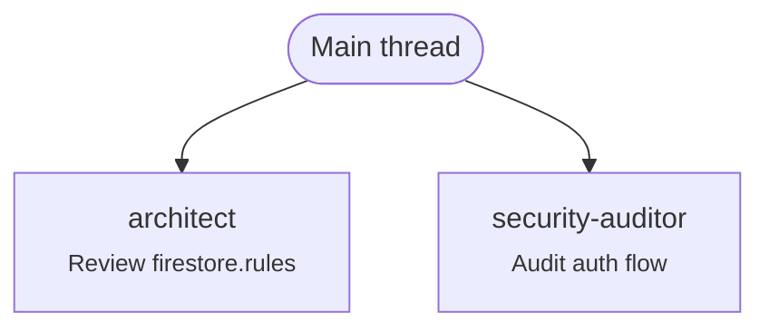

# 🐺 LA BESTIA — Cómo funciona, cómo se activa, cómo observarla

> Referencia operativa de la Bestia v0.1.
> Para quickstart ver `../README.md`.
> Para arquitectura/decisiones ver `../memory/decisions/`.

---

## Índice

1. [Vault y persistencia](#1-vault-y-persistencia)
2. [Cómo se activa la configuración](#2-cómo-se-activa-la-configuración)
3. [Cómo veo qué agente está ejecutando](#3-cómo-veo-qué-agente-está-ejecutando)
4. [Estado real — qué funciona, qué es probabilístico](#4-estado-real)
5. [Comandos Claude Code recomendados](#5-comandos-claude-code-recomendados)
6. [Mejoras pendientes priorizadas](#6-mejoras-pendientes-priorizadas)
7. [Troubleshooting](#7-troubleshooting)

---

## 1. Vault y persistencia

### Vault Obsidian

| Item | Estado | Path |
|---|---|---|
| Obsidian app instalada | ✅ | `/Applications/Obsidian.app` |
| Vault creado | ✅ | `~/Obsidian/claude-brain/` |
| Vault abierto en la app | ❌ — abrir 1 vez manualmente | `open -a Obsidian ~/Obsidian/claude-brain` |

Estructura del vault:
```
~/Obsidian/claude-brain/
├── HOT.md                  # últimos 7 días — inyectado al iniciar sesión
├── INDEX.md                # mapa global
├── CLAUDE.md               # instrucciones vault-side
├── permanent/
│   ├── patterns/           # 1 idea = 1 nota atómica
│   ├── decisions/          # ADRs cross-project
│   └── gotchas/            # bugs raros, quirks
├── projects/<slug>/        # 1 dir por proyecto (ej. catalift-app-main)
├── inbox/                  # captura sin curar (sesiones)
└── templates/              # pattern, gotcha, decision
```

### Persistencia de sesiones (automática, sin config)

Claude Code guarda **cada sesión** como JSONL completo en:
```
~/.claude/projects/<encoded-cwd>/<session-id>.jsonl
```

El nombre del directorio reemplaza `/` por `-`. Ejemplos reales en tu sistema:
- `~/.claude/projects/-Users-wilserbatistamarcelino-Desktop-catalift-app-main/`
- `~/.claude/projects/-Users-wilserbatistamarcelino-Downloads-Claude-Code/`

Cada `.jsonl` contiene **todo el transcript**: prompts, respuestas, tool calls, results, subagent invocations.

Inspeccionar la última sesión de Catalift:
```bash
LATEST=$(ls -t ~/.claude/projects/-Users-wilserbatistamarcelino-Desktop-catalift-app-main/*.jsonl | head -1)
jq '.' "$LATEST" | less
```

Filtrar solo invocaciones de subagent:
```bash
jq 'select(.type == "tool_use" and .name == "Task") | {agent: .input.subagent_type, desc: .input.description}' "$LATEST"
```

### Re-abrir una sesión vieja

```bash
claude --resume   # menú de sesiones recientes
# o desde dentro:
/resume
```

---

## 2. Cómo se activa la configuración

**Sola.** No hay "activar". Es por presencia de archivos en orden:

```
Al ejecutar `claude` en un directorio:

1. Lee ~/.claude/CLAUDE.md           ← persona CTO + 5 preguntas + 10 principios
2. Lee ~/.claude/settings.json       ← env vars + permissions + hooks + statusline
3. Carga ~/.claude/agents/*.md       ← 6 subagents disponibles
4. Carga metadata de ~/.claude/skills/*/SKILL.md  ← solo metadata (~100 tok cada uno)
5. Lee <cwd>/CLAUDE.md (si existe)   ← overrides project (Catalift tiene)
6. Merge <cwd>/.claude/settings.json con global
7. Lee <cwd>/.claude/settings.local.json (si existe) — per-machine, no commited
8. Corre hook SessionStart           ← inyecta HOT.md + git status + reglas Catalift
9. Cualquier prompt → hook UserPromptSubmit (route-prompt.sh)
10. Cualquier escritura → hook PreToolUse (block-secrets.sh)
11. Cualquier subagent → hook PostToolUse (log-agents.sh) → JSONL
12. Al cerrar → hook Stop (log-session.sh) → placeholder al inbox del vault
```

### Reglas de precedencia

```
<repo>/.claude/settings.local.json   (per-machine, gitignored)
   ↓ overridea
<repo>/.claude/settings.json          (commited al repo)
   ↓ overridea
~/.claude/settings.json               (global)
```

Lo mismo con `CLAUDE.md` (project > global) y agents (project mismo nombre overridea global).

### Verificar que todo está OK

```bash
bash ~/.claude/scripts/verify.sh
```
Output esperado: `Pass: 22  Fail: 0  Warn: 3` (warns son ccusage/gh/ruff opcionales).

---

## 3. Cómo veo qué agente está ejecutando

**4 mecanismos**, ordenados por inmediatez.

### 3.1 Inline en el chat (default — ya activo)

Cuando se invoca un subagent ves en el chat:
```
● Agent(architect)
  ⎿  [resumen del trabajo del subagent]
```
Vos ves: **nombre del agent + descripción + summary final**.
NO ves el contexto interno del subagent (esa es la idea — aislamiento de contextos).

### 3.2 Statusline 🐺 (bottom de la pantalla)

```
🐺 catalift-app-main [main*] | claude-opus-4-7 | $0.42 today | last: architect
```

Lectura:
- `🐺 catalift-app-main` — proyecto (cwd basename)
- `[main*]` — branch + `*` si hay uncommitted
- `claude-opus-4-7` — modelo activo
- `$0.42 today` — costo del día (requiere ccusage instalado)
- `last: architect` — último subagent invocado en la sesión

Configurada en `~/.claude/settings.json` campo `statusLine`. Script: `~/.claude/scripts/statusline.sh`.

### 3.3 Flow diagram Mermaid (post-sesión, visual)

Después de una sesión con subagents:
```bash
bash ~/.claude/scripts/flow-diagram.sh           # imprime Mermaid a stdout
bash ~/.claude/scripts/flow-diagram.sh --save    # guarda al vault inbox
```

Genera un `.md` con `flowchart TD`:


Abrilo en Obsidian (renderiza nativo) o en GitHub. Guarda en `~/Obsidian/claude-brain/inbox/flow-<timestamp>.md`.

### 3.4 Transcript JSONL crudo (forensic)

```bash
LATEST=$(ls -t ~/.claude/projects/-Users-wilserbatistamarcelino-Desktop-catalift-app-main/*.jsonl | head -1)

# Solo invocaciones de subagent
jq 'select(.type == "tool_use" and .name == "Task") | {agent: .input.subagent_type, desc: .input.description}' "$LATEST"

# Todos los tool calls
jq 'select(.type == "tool_use") | {tool: .name, input: .input}' "$LATEST"

# Solo tu prompts (sin respuestas)
jq 'select(.type == "user") | .message.content' "$LATEST"
```

### 3.5 Logs de hooks (cross-session)

```bash
~/.claude/logs/agents.jsonl    # 1 línea JSON por subagent invocado (todas las sesiones)
~/.claude/logs/bash.jsonl      # 1 línea por comando bash ejecutado
~/.claude/logs/sessions/all.log # log de inicio/fin de sesiones
```

Empiezan vacíos — se popula desde la próxima sesión que invoque tools.

---

## 4. Estado real

Honesto, qué funciona y qué no:

| Componente | Funciona | Notas |
|---|---|---|
| 6 agents declarados | ✅ Auto | Disponibles via `Task` tool |
| Auto-invocación por keywords | 🟡 Probabilístico | El hook `route-prompt.sh` sugiere; Claude decide |
| Hooks deterministas (block-secrets, etc.) | ✅ 100% | Probado con `verify.sh` smoke test |
| Statusline | ✅ Configurada | Visible al iniciar `claude` |
| Slash commands custom | ✅ | `/cto-review`, `/parallel-research`, `/ship-it`, `/deep-debug` |
| Skills (auto-trigger) | 🟡 Probabilístico | Claude carga el body cuando matchea description |
| Flow diagram | ✅ Funciona | Solo si hooks loggean (próxima sesión) |
| Vault inject al inicio | ✅ Funciona | Si `HOT.md` existe (existe) |
| Project SessionStart hook (Catalift) | ✅ Funciona | Recordatorios al abrir `claude` en Catalift |
| Sesiones persistentes (`.jsonl`) | ✅ Auto | Sin config — Claude Code lo hace solo |
| MCP memory server | 🟡 Activo si `.mcp.json` | Knowledge graph — opcional |

### Cómo forzar invocación de un agent (si auto no decide)

```
Use the architect agent to design X
Use the security-auditor agent to audit firestore.rules
```

O slash command:
```
/cto-review este cambio
/deep-debug el error de timezone en cron
```

---

## 5. Comandos Claude Code recomendados

### Built-in que probablemente no estás usando

| Comando | Qué hace | Cuándo |
|---|---|---|
| `/model opusplan` | Híbrido Opus plan + Sonnet exec | Default sesión — siempre |
| `/model opus` | Switch a Opus full | Bug duro, refactor cross-module |
| `/model sonnet` | Vuelta a ejecución | Después de planning |
| `/model haiku` | Switch a Haiku | Transformaciones masivas idénticas |
| `Shift+Tab Shift+Tab` | Activar Plan Mode | Antes de cualquier cambio no-trivial |
| `/compact <instrucciones>` | Compactar contexto | Cuando supera ~60% |
| `/clear` | Borrar contexto | Cambio de tarea |
| `/agents` | Lista agents disponibles | Verificar setup |
| `/mcp` | Lista MCP servers | Verificar memory server |
| `/cost` | Costo de la sesión | Quick check |
| `/status` | Estado: model, tools, MCPs | Debug |
| `/permissions` | Ver/editar permissions | Cuando algo se bloquea |
| `/resume` | Reabrir sesión anterior | Continuar contexto |
| `/init` | Genera CLAUDE.md inicial | Repo nuevo |
| `/output-style cto-terse` | Activar style terse | Forzar concisión |

### Custom (de la Bestia)

| Comando | Qué hace |
|---|---|
| `/cto-review` | Review CTO senior con 5 preguntas + 10 principios |
| `/parallel-research <topic>` | Fan-out 3-5 subagents paralelos |
| `/ship-it` | Quality gates pre-merge + commit + PR |
| `/deep-debug <bug>` | Switch Opus + debugger agent |

### Comandos de shell útiles para la Bestia

```bash
bash ~/.claude/scripts/verify.sh                # health check del setup
bash ~/.claude/scripts/flow-diagram.sh --save   # generar flow Mermaid
ccusage daily                                   # tokens del día
ccusage blocks --live                           # TUI en vivo durante sesión
open -a Obsidian ~/Obsidian/claude-brain        # abrir vault
```

---

## 6. Mejoras pendientes priorizadas

| # | Acción | Tiempo | ROI |
|---|---|---|---|
| 1 | `npm i -g ccusage` | 30s | Sin esto no medís nada |
| 2 | Abrir vault en Obsidian 1 vez | 1 min | Para ver grafo + curar |
| 3 | Aliases zsh (ver abajo) | 1 min | Acceso rápido |
| 4 | Probar `/cto-review` en sesión real | 5 min | Validar cadena |
| 5 | VS Code extension de Claude Code | 2 min | Mejor visibility inline |
| 6 | Migrar 4 workflows viejos (Catalift backup) a skills | 15 min | No perder capacity |
| 7 | Setup `git rm --cached` para `_scratch/ffmpeg_test/*` | 30s | Limpiar tracked-now-ignored |
| 8 | Curar HOT.md semanalmente | 5 min/semana | Mantiene vault útil |

### Aliases recomendados (`~/.zshrc`)

```bash
# Bestia
alias bcheck='bash ~/.claude/scripts/verify.sh'
alias bflow='bash ~/.claude/scripts/flow-diagram.sh --save'
alias bvault='open -a Obsidian ~/Obsidian/claude-brain'
alias bhot='vim ~/Obsidian/claude-brain/HOT.md'
alias btoday='ccusage daily'
```

---

## 7. Troubleshooting

### Hook no corre
```bash
ls -la ~/.claude/hooks/         # ¿executable bit?
bash ~/.claude/scripts/verify.sh
```

### Agent no se invoca automáticamente
- ¿Frontmatter `description` tiene las keywords del prompt?
- Forzá explícitamente: `Use the <agent-name> agent to ...`
- Verificá: `/agents` debe listarlo

### settings.json roto (sintaxis)
```bash
jq empty ~/.claude/settings.json    # debe ser silencioso
jq empty <repo>/.claude/settings.json
```

### Tokens disparados
```bash
ccusage blocks --live
/compact preserve: ... resume: ...
/model haiku                        # si es exploración
/clear                              # si es tarea distinta
```

### Statusline no aparece
- Reiniciá la sesión de Claude Code (la statusline se carga al inicio)
- `bash ~/.claude/scripts/statusline.sh` — debería imprimir algo
- Verificá `jq` instalado

### Vault no se inyecta al inicio
- Verificá `~/Obsidian/claude-brain/HOT.md` existe
- `bash ~/.claude/hooks/inject-context.sh` — debería imprimir algo

### MCP memory server no funciona
- `/mcp` para listar
- Reinstalá: `claude mcp restart memory`

---

## 8. Lifecycle típico de una sesión real

```
1. cd /Users/wilserbatistamarcelino/Desktop/catalift-app-main
2. claude
   → SessionStart hook inyecta HOT.md + reglas Catalift
   → Statusline 🐺 aparece bottom
3. /model opusplan                      ← default recomendado
4. "Quiero refactorizar la lógica de notificaciones push"
   → UserPromptSubmit hook sugiere: cto-strategist o architect
   → Claude (Opus en plan mode) lee, propone plan
5. Aprobás el plan → switch a Sonnet automáticamente
6. Implementación con Edit/Write
   → PreToolUse hook valida (block-secrets)
   → PostToolUse hook formatea (prettier/ruff)
7. Después de cambios → "review esto"
   → Claude invoca code-reviewer agent
   → Verás: ● Agent(code-reviewer) ... summary
   → Statusline updateá: last: code-reviewer
8. Si tocó auth → invoca security-auditor
9. /ship-it
   → Tests + linter + secret scan + review chain
   → Conventional commit + (opcional) PR
10. Cerrás Claude
    → Stop hook crea placeholder en ~/Obsidian/claude-brain/inbox/
11. bash ~/.claude/scripts/flow-diagram.sh --save
    → Mermaid del flow → vault inbox
12. Mañana: bash ~/.claude/scripts/verify.sh && claude
    → SessionStart inyecta HOT.md actualizado con lo de ayer
```

---

## Referencias

- Quickstart: `../README.md`
- ADR del setup: `../memory/decisions/0001-bestia-v0.1.md`
- Constitución global: `~/.claude/CLAUDE.md`
- Backup pre-bestia: `../_archive/2026-05-01-pre-bestia/`
- Backup Catalift: `../_archive/2026-05-01-catalift-pre-bestia/`
